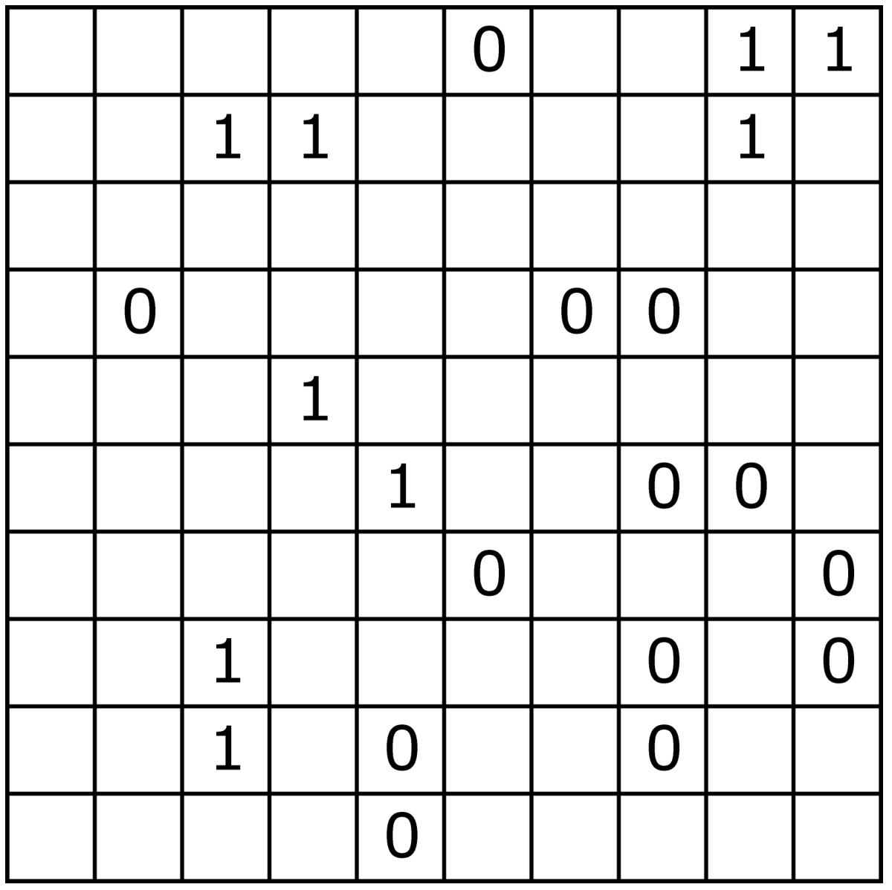

# Binairo
Binairo is a pencil and paper game similar to sudoku. This project aims to generate binairo puzzles which are fun to solve for humans. This is achieved by implementing various humanlike tactics which are used to grade the difficulty of binairo puzzles. The puzzle generation algorithm is extremely simple, it removes all those numbers, such that the puzzle is within the aimed difficulty. In addition to the humanlike solver implementation this project also includes a super efficient SAT/ILP solver for binairo using Z3. This is useful for checking whether the puzzle has only one unique solution. A generated puzzle of easy difficulty can be seen below.

